  

  

  
  
  
  

## Sobre mim

Atuo na interseção entre **engenharia de software, IA aplicada, automação, dados e infraestrutura**. Projeto e entrego sistemas de ponta a ponta: interfaces web e mobile, APIs, bancos relacionais, integrações corporativas, agentes de IA e fluxos resilientes para operações reais.

Minha base técnica combina **TypeScript, React, Next.js, Node.js, Python, FastAPI, React Native, PostgreSQL, Supabase/RLS e PostGIS**. Na camada de IA, trabalho com LLMs, agentes, roteamento de modelos, memória contextual e voz com Whisper. Também assumo a operação em produção com Linux, Docker, Nginx, Proxmox, redes, VPNs, FortiGate e MikroTik — sempre com foco em segurança, observabilidade e rastreabilidade.

`Engenharia de Software` · `Sistemas de IA` · `Automação` · `Infraestrutura` · `São José dos Pinhais, PR`

> 🔒 **Sobre os repositórios:** a maior parte dos projetos permanece privada por envolver sistemas reais, dados operacionais, nomes, marcas e integrações de empresas. Aqui apresento apenas o contexto técnico autorizado, preservando confidencialidade, propriedade intelectual, contratos e direitos autorais.

Conheça meus projetos em **[meetallan.com](https://meetallan.com)** e a empresa em **[lanfuture.dev](https://lanfuture.dev)**.

## Stack principal

  
  
  
  
  
  
  
  
  

<strong>Ver ecossistema completo</strong>

 

**Linguagens:** TypeScript · JavaScript · Python · Go · Kotlin · SQL · HTML · CSS · Shell · GDScript

**Produto:** React · Next.js · React Native · Expo · Node.js · FastAPI · Flutter · Vite

**Dados e operação:** PostgreSQL · Supabase · PostGIS · Prisma · Power BI · Docker · Nginx · Proxmox · Fortinet · MikroTik · Microsoft 365

## GitHub em números

  

  
  

  <strong>Software que sai do protótipo e chega à operação.</strong>  
  <a href="https://meetallan.com"><strong>Conheça meus projetos</strong></a>
  &nbsp;·&nbsp;
  <a href="https://lanfuture.dev"><strong>Conheça a LanFuture</strong></a>
  &nbsp;·&nbsp;
  <a href="mailto:allansilvapereirae@gmail.com"><strong>Contato</strong></a>
  &nbsp;·&nbsp;
  <a href="https://github.com/allan-xln?tab=repositories"><strong>Repositórios</strong></a>

 

  Software · AI · Automation · Infrastructure

